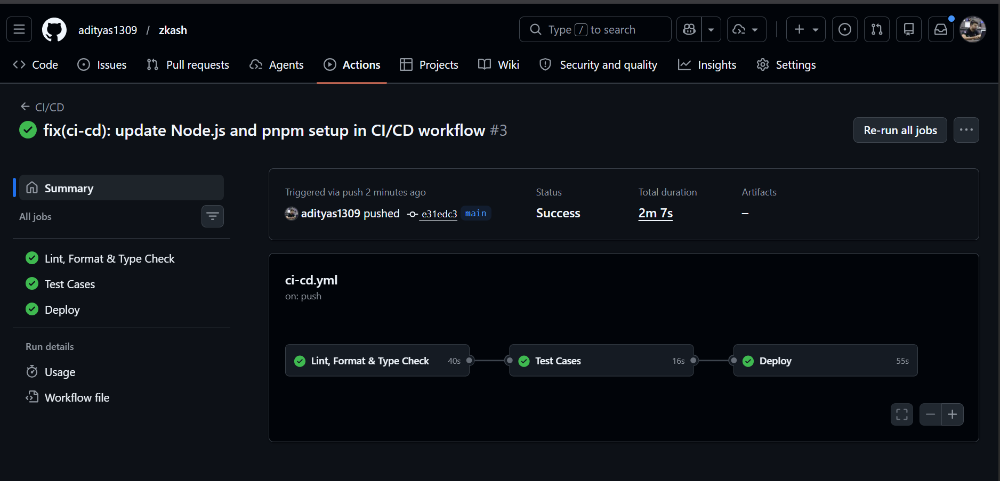

# ZKASH 🛡️

> **Privacy-first P2P payments and crypto swap application on the Stellar network using Zero-Knowledge proofs. Send and trade assets seamlessly and privately.**

---

## Table of Contents

- [Live Links](#-live-links)
- [Website Screenshots](#website-screenshots)
- [Smart Contracts](#-smart-contracts)
- [Key Features](#-key-features)
- [Architecture & Tech Stack](#-architecture--tech-stack)
- [Local Setup & Development](#️-local-setup--development)
- [CI/CD Pipeline](#cicd-pipeline)
- [References](#-references)
- [User Onboarding & Feedback](#-user-onboarding--feedback)
- [Submission Checklist](#-submission-checklist)
- [User Details](#user-details)

---

## 🚀 Live Links

- **Deployed Website:** [zkash-swap.vercel.app](https://zkash-swap.vercel.app)
- **Demo Video:** [YouTube Walkthrough](https://youtu.be/9XibJXIC4qg)

---

## Website Screenshots

| Screenshot 1                                          | Screenshot 2                                          |
| ----------------------------------------------------- | ----------------------------------------------------- |
| .png>) | .png>) |

| Screenshot 3                                          | Screenshot 4                                          |
| ----------------------------------------------------- | ----------------------------------------------------- |
| .png>) | .png>) |

---

## 📜 Smart Contracts

Our smart contracts are deployed and verifiable on the Stellar network:

### Testnet

| Contract                 | Address / Link                                                                                                                                                          |
| ------------------------ | ----------------------------------------------------------------------------------------------------------------------------------------------------------------------- |
| **Groth16 Verifier**     | [`CBYARZ3ES7QXQGEKOP6LPNR7A2TNDYXKQGWPW7ALDCCIDHLFZADUSKSP`](https://stellar.expert/explorer/testnet/contract/CBYARZ3ES7QXQGEKOP6LPNR7A2TNDYXKQGWPW7ALDCCIDHLFZADUSKSP) |
| **Shielded Pool (USDC)** | [`CBQRQOQHPG4PV2LZUPSPGTLM2NKCJLMBPYXLR5OHXN5WNJNDF3FHWBKE`](https://stellar.expert/explorer/testnet/contract/CBQRQOQHPG4PV2LZUPSPGTLM2NKCJLMBPYXLR5OHXN5WNJNDF3FHWBKE) |
| **Shielded Pool (XLM)**  | [`CB54OKOYUN66RZDA6S6IQN3XIFYVWIBJCHRB5HOWEKRTAXJ6MXYHDJDP`](https://stellar.expert/explorer/testnet/contract/CB54OKOYUN66RZDA6S6IQN3XIFYVWIBJCHRB5HOWEKRTAXJ6MXYHDJDP) |
| **ZK Swap**              | [`CCCTNLJWDYI2AYW4GMHGIECV63GVBR7FZW25RP6HI47GO537SPZWXBCX`](https://stellar.expert/explorer/testnet/contract/CCCTNLJWDYI2AYW4GMHGIECV63GVBR7FZW25RP6HI47GO537SPZWXBCX) |

### Mainnet

| Contract                 | Address / Link                                                                                                                                                         |
| ------------------------ | ---------------------------------------------------------------------------------------------------------------------------------------------------------------------- |
| **Groth16 Verifier**     | [`CA6NRLSK6Y5TFJTQT7LRN6DD7GJ4S6XITIJQSO3PLNW2U4BSVMYJARM6`](https://stellar.expert/explorer/public/contract/CA6NRLSK6Y5TFJTQT7LRN6DD7GJ4S6XITIJQSO3PLNW2U4BSVMYJARM6) |
| **Shielded Pool (USDC)** | [`CA44UAU35XSFIKPANNNUTEXEOEELDEFYMVY7XLLNGM7ABBPWUN6GHZLU`](https://stellar.expert/explorer/public/contract/CA44UAU35XSFIKPANNNUTEXEOEELDEFYMVY7XLLNGM7ABBPWUN6GHZLU) |
| **Shielded Pool (XLM)**  | [`CCOED73UUQOVYUVHRSORTVHCIHZSPOL64PITWV2XDRM4HAQ55KVTG4MM`](https://stellar.expert/explorer/public/contract/CCOED73UUQOVYUVHRSORTVHCIHZSPOL64PITWV2XDRM4HAQ55KVTG4MM) |
| **ZK Swap**              | [`CC7ODJ2I23EF3CWIUNJETJHXXTUSLEFUO3M36I5VMYKTDIYDZTO6G6AM`](https://stellar.expert/explorer/public/contract/CC7ODJ2I23EF3CWIUNJETJHXXTUSLEFUO3M36I5VMYKTDIYDZTO6G6AM) |

---

## 🌟 Key Features

- **Zero-Knowledge Privacy:** Enjoy truly private transactions using state-of-the-art zk-SNARKs (Groth16, BLS12-381). Hide amounts and transaction details from the public ledger.
- **P2P Atomic Swaps:** Trustlessly swap tokens (e.g., USDC to XLM) with peers without a centralized exchange or exposing your financial data.
- **Stellar & Soroban Integration:** Built on the blazing-fast Stellar network leveraging advanced Soroban smart contracts.
- **Fiat On-Ramp & Off-Ramp:** Integrated with Razorpay seamlessly bridging the gap between traditional finance and decentralized privacy.
- **Automated Withdrawals:** Smooth and automated exits from the shielded pool to public accounts right after swapping.
- **Seamless Authentication:** Google OAuth integrated for a frictionless user onboarding experience.

---

## 🛠 Architecture & Tech Stack

ZKASH is built with a modern, high-performance tech stack:

- **Frontend:** Next.js 14, TailwindCSS, `@stellar/stellar-sdk`, `snarkjs`
- **Backend:** NestJS, MongoDB, Google OAuth, Stellar SDK
- **Smart Contracts:** Soroban / Rust (`ShieldedPool`, `ZKSwap`)
- **Circuits:** Circom + SnarkJS (BLS12-381 Curve)
- **Indexer:** Background service listening to Soroban events and managing encrypted notes.

---

## ⚙️ Local Setup & Development

### Prerequisites

- Node.js 20+
- `pnpm`
- MongoDB
- Rust (for compiling Soroban contracts)
- Circom (for circuit compilation)

### 1. Environment Configuration

Create `.env` inside `apps/api` and `.env.local` inside `apps/web` based on the provided setup. Example API `.env`:

```bash
MONGODB_URI=mongodb://localhost:27017/lop
GOOGLE_CLIENT_ID=<your-client-id>
GOOGLE_CLIENT_SECRET=<your-client-secret>
GOOGLE_CALLBACK_URL=http://localhost:3001/auth/google/callback
FRONTEND_URL=http://localhost:3000
SESSION_SECRET=your-secret
CORS_ORIGIN=http://localhost:3000
RPC_URL=https://soroban-testnet.stellar.org

# Stellar Contracts (Testnet)
GROTH16_VERIFIER_ADDRESS=CBYARZ3ES7QXQGEKOP6LPNR7A2TNDYXKQGWPW7ALDCCIDHLFZADUSKSP
SHIELDED_POOL_ADDRESS=CBQRQOQHPG4PV2LZUPSPGTLM2NKCJLMBPYXLR5OHXN5WNJNDF3FHWBKE
ZK_SWAP_ADDRESS=CCCTNLJWDYI2AYW4GMHGIECV63GVBR7FZW25RP6HI47GO537SPZWXBCX
SHIELDED_POOL_XLM_ADDRESS=CB54OKOYUN66RZDA6S6IQN3XIFYVWIBJCHRB5HOWEKRTAXJ6MXYHDJDP

# Stellar Contracts (Mainnet)
# GROTH16_VERIFIER_ADDRESS=CA6NRLSK6Y5TFJTQT7LRN6DD7GJ4S6XITIJQSO3PLNW2U4BSVMYJARM6
# SHIELDED_POOL_ADDRESS=CA44UAU35XSFIKPANNNUTEXEOEELDEFYMVY7XLLNGM7ABBPWUN6GHZLU
# ZK_SWAP_ADDRESS=CC7ODJ2I23EF3CWIUNJETJHXXTUSLEFUO3M36I5VMYKTDIYDZTO6G6AM
# SHIELDED_POOL_XLM_ADDRESS=CCOED73UUQOVYUVHRSORTVHCIHZSPOL64PITWV2XDRM4HAQ55KVTG4MM
```

### 2. Install Dependencies

```bash
pnpm install
```

### 3. Run the Application

Start the respective services in different terminals:

```bash
# Start the Backend API (runs on port 3001)
pnpm dev:api

# Start the Frontend App (runs on port 3000)
pnpm dev:web

# Start the Indexer (optional, for syncing events)
pnpm dev:indexer
```

### 4. Build Zero-Knowledge Circuits

Private send and swap generate ZK proofs in the API. Build the circuit and run the trusted setup.

```bash
cd packages/circuits
pnpm run build    # Compiles circuit, produces build/main_js/main.wasm
pnpm run setup    # Trusted setup: produces output/main_final.zkey and output/verification_key.json
```

_(Do not commit `main_final.zkey` as it is a large file)._

### 5. Build Smart Contracts

```bash
cd packages/contracts
cargo build --target wasm32-unknown-unknown --release -p shielded_pool
soroban contract optimize --wasm target/wasm32-unknown-unknown/release/shielded_pool.wasm -o shielded_pool.optimized.wasm
```

---

## CI/CD Pipeline

The GitHub Actions workflow in [`.github/workflows/ci-cd.yml`](./.github/workflows/ci-cd.yml) runs on every push, pull request, and manual dispatch.



| Stage                     | Command           | Purpose                                                                                            |
| ------------------------- | ----------------- | -------------------------------------------------------------------------------------------------- |
| Lint, Format & Type Check | `pnpm ci:quality` | Runs Next.js linting, Prettier formatting checks, and TypeScript checks across workspace packages. |
| Test Cases                | `pnpm ci:test`    | Runs the workspace test suite after quality checks pass.                                           |
| Deployment                | Vercel CLI        | Deploys `apps/web` to production after tests pass on `main`, `master`, or manual dispatch.         |

Deployment requires one GitHub repository secret:

- `VERCEL_TOKEN`

Deployment also expects these GitHub repository variables:

- `VERCEL_ORG_ID`
- `VERCEL_PROJECT_ID`

---

## 📚 References

- [Stellar Protocol 25 Upgrade Guide](https://stellar.org/blog/developers/stellar-x-ray-protocol-25-upgrade-guide)
- [Soroban Privacy Pools](https://github.com/ymcrcat/soroban-privacy-pools)
- [Stellar Soroban Examples: Groth16 Verifier](https://github.com/stellar/soroban-examples/tree/main/groth16_verifier)

---

<p align="center">
  Built with ❤️ for the Stellar Ecosystem.
</p>

---

## 📈 User Onboarding & Feedback

We actively collect user feedback to improve ZKASH and deliver a better experience.

All anonymized user feedback and testnet wallet addresses (created before April 2026) have been recorded for transparency.
**Download User Data:** [user_feedback.csv](./user_feedback.csv)

### Future Improvements Based on Feedback

We have listened to your pain points! Below is how the app has evolved based on the collected feedback:

| #   | Feedback                                                                                        | Resolution                                                                                               |
| --- | ----------------------------------------------------------------------------------------------- | -------------------------------------------------------------------------------------------------------- |
| 1   | I keep hitting avoidable request errors because the app accepts messy transaction inputs.       | [Commit `d5b95ed`](https://github.com/adityas1309/zkash/commit/d5b95ed9f2f17f8b273b74ea8d69aa53defab085) |
| 2   | I can’t trust private balance updates when indexer health and gasless behavior are invisible.   | [Commit `f2e24e8`](https://github.com/adityas1309/zkash/commit/f2e24e880e20a30cc23efce52eca7ead80570654) |
| 3   | The dashboard still feels like a static demo instead of a live product.                         | [Commit `52126c1`](https://github.com/adityas1309/zkash/commit/52126c135613bf270004ba31a8fd713aed059444) |
| 4   | Fee sponsorship still feels unpredictable and too technical.                                    | [Commit `b176318`](https://github.com/adityas1309/zkash/commit/b176318cc6f6a558f8f1f5cfe4cffbe33d8a9ece) |
| 5   | I can’t audit what happened across payments, deposits, and withdrawals.                         | [Commit `3057592`](https://github.com/adityas1309/zkash/commit/3057592db17e42add05695401b94408e0f19e161) |
| 6   | Swap transactions are too opaque to debug when proofs or execution go wrong.                    | [Commit `518cedf`](https://github.com/adityas1309/zkash/commit/518cedf4e6a4aecf7f5ea6fdd9754a9123bfc9d1) |
| 7   | The swap page doesn’t show enough lifecycle detail to feel reliable.                            | [Commit `214171d`](https://github.com/adityas1309/zkash/commit/214171de53b58b17d9af423f98d1bf3c6261ca8f) |
| 8   | I can’t tell which offers are actually worth responding to.                                     | [Commit `cf8d467`](https://github.com/adityas1309/zkash/commit/cf8d4675fe93f82435636c7281a55e1149c7b0e6) |
| 9   | The market board needs stronger filters and clearer quality signals.                            | [Commit `29ea90c`](https://github.com/adityas1309/zkash/commit/29ea90cac72a0819d66cbab407be334bd9b63086) |
| 10  | Publishing an offer feels blind because I can’t judge rate placement first.                     | [Commit `1a00d4b`](https://github.com/adityas1309/zkash/commit/1a00d4b08532eafd57af5e56ff41a351ec078cd4) |
| 11  | My payment, private, and swap activity is scattered and hard to follow.                         | [Commit `89218bd`](https://github.com/adityas1309/zkash/commit/89218bdfa428e141d605f97525b8946f399350b3) |
| 12  | The wallet view is fragmented and doesn’t explain my real balance posture.                      | [Commit `3d95167`](https://github.com/adityas1309/zkash/commit/3d951673c15a167dfad30133127e05a0aa7ef3d6) |
| 13  | The dashboard should reflect my real workspace state, not stitched-together widgets.            | [Commit `32fc476`](https://github.com/adityas1309/zkash/commit/32fc4762f5ee6ffd9c368de35d416569769ca66b) |
| 14  | Fiat on-ramp and off-ramp flow is too shallow to plan around.                                   | [Commit `7704126`](https://github.com/adityas1309/zkash/commit/770412633ce76bc894f7ee19f820562a1e79c1cd) |
| 15  | I need one trustworthy place to check system health and monitoring.                             | [Commit `7fe4e3e`](https://github.com/adityas1309/zkash/commit/7fe4e3e98e558aca95ffe5d553de9ac21530a7da) |
| 16  | Managing my own offers feels messy and I can’t see queue pressure clearly.                      | [Commit `eeedcd4`](https://github.com/adityas1309/zkash/commit/eeedcd459b7bb63b2d830ba14de0e0c05429d041) |
| 17  | After sign-in, I still don’t know what the first useful action should be.                       | [Commit `7a18708`](https://github.com/adityas1309/zkash/commit/7a18708e8ce2a94fb352e60866d3042dcb6112ed) |
| 18  | History should help me recover from problems, not just show old events.                         | [Commit `38cab9e`](https://github.com/adityas1309/zkash/commit/38cab9ebbdee1cebc35402c592ccd2a917c5e498) |
| 19  | I need route planning before sending, not after a transfer fails.                               | [Commit `0322340`](https://github.com/adityas1309/zkash/commit/03223405e1aabc54c39ed22d4ed8029d7f3b44a0) |
| 20  | Fiat routes need better route planning and execution context.                                   | [Commit `9c7aea1`](https://github.com/adityas1309/zkash/commit/9c7aea12cbfdbe38d365934f9418273be400cc2d) |
| 21  | Wallet funding and first-use setup still feel awkward and manual.                               | [Commit `973efd3`](https://github.com/adityas1309/zkash/commit/973efd30ca35af56d7e724ebbc66563e2831dfca) |
| 22  | I need a proper account center with safer profile and deletion controls.                        | [Commit `c3ffac1`](https://github.com/adityas1309/zkash/commit/c3ffac1893bd733b5325e77d32e6b8f7e1bcb59e) |
| 23  | I don’t know which issue matters most right now.                                                | [Commit `b816b8d`](https://github.com/adityas1309/zkash/commit/b816b8d84fe8ab363a63e76dca4ef33c6d1f762a) |
| 24  | Status data is helpful, but I still need remediation guidance when things degrade.              | [Commit `361e04d`](https://github.com/adityas1309/zkash/commit/361e04d9114ae4cd906db7c11f86ed6119f4c417) |
| 25  | Each swap needs its own control tower so I can see proof, execution, and next actions together. | [Commit `b495e26`](https://github.com/adityas1309/zkash/commit/b495e268e4b80571e7b2b4760dacfdd755166f4e) |
| 26  | I want reusable counterparty intelligence instead of starting every send from zero.             | [Commit `840c3fc`](https://github.com/adityas1309/zkash/commit/840c3fc2565b06a48bfd000242ef011778ca76e2) |
| 27  | I can’t clearly see how my capital is split across public and private posture.                  | [Commit `9162b51`](https://github.com/adityas1309/zkash/commit/9162b517e45e9a5e52ed6fdd82da623abca6c548) |
| 28  | I need the product to recommend strategy, not just expose more pages.                           | [Commit `0021fad`](https://github.com/adityas1309/zkash/commit/0021fadfde8b83ac73c8a29e6f481704935397de) |
| 29  | I still can’t tell what has really settled and what is just in flight.                          | [Commit `c1fd50e`](https://github.com/adityas1309/zkash/commit/c1fd50e1213553c76e07c1a7970dd74c0c635e0f) |
| 30  | I need to know what capital is actually deployable right now versus idle or stuck.              | [Commit `238208e`](https://github.com/adityas1309/zkash/commit/238208e1d5879113939d8827fbe9cbe73857383c) |

---

## ✅ Submission Checklist

- [x] **Public GitHub repository**
- [x] **README with complete documentation**
- [x] **Technical documentation and user guide**
- [x] **Minimum 30 meaningful commits**
- [x] **Demo Day presentation prepared**

### Core Requirements

- **Live Demo Link:** [zkash-swap.vercel.app](https://zkash-swap.vercel.app)
- **30+ User Wallet Addresses:** Available in [user_feedback.csv](./user_feedback.csv) (all visible on [Stellar Testnet Explorer](https://stellar.expert/explorer/testnet/))
- **Security Checklist:** [Completed Security Audit](./docs/SECURITY.md)
- **Community Contribution:** [Twitter Product Announcement](https://x.com/zkash_swap)

### 🚀 Advanced Features Implemented

- **Fee Sponsorship:** Gasless transactions are natively supported via Stellar fee bumps for onboarding.
- **Data Indexing:** The API includes a background indexer that syncs Soroban events to MongoDB to track wallet activities, deposits, and private pool state.

---

## User Details

| #   | Wallet Address                                           | Name                    | Email                         | Product Feedback                                                                                |
| --- | -------------------------------------------------------- | ----------------------- | ----------------------------- | ----------------------------------------------------------------------------------------------- |
| 1   | GA5J4MOVDMUETLSNS64FMIUIL7NVHLV6PUAJICJ3K7GAKT3CRLFSXAJN | Abhiraj Sinha           | abhirajsinha123@gmail.com     | I keep hitting avoidable request errors because the app accepts messy transaction inputs.       |
| 2   | GA4KXHTJ6DH7E76XBY6VVMFB6MBXRO36V7HEPI4UO4YMQVQPNKVE4ITA | Abhishek Dubey          | abhishekdubey99@gmail.com     | I can’t trust private balance updates when indexer health and gasless behavior are invisible.   |
| 3   | GAFQMAQIWLWWK6KBKIUGQMQPQGC7NVIC2JQ76RBTQHBCZKFVRCO7TU3V | Abhishek kumar          | abhishekkumar.x@gmail.com     | The dashboard still feels like a static demo instead of a live product.                         |
| 4   | GDEMO57MLRGIYMNB5X56F5MBDT5SZAJVPC6LJOCVN4Q4UHE3ODEEJM3B | Abir Ghosh              | abirg0747.dev@gmail.com       | Fee sponsorship still feels unpredictable and too technical.                                    |
| 5   | GCMCV3MMSETAB2HGCM4SO42C5TPNCYEP2AWZWOCWN53UCSUS7ESM3ZP6 | ADARSH KUMAR MISHRA     | adarshmishra.tech@gmail.com   | I can’t audit what happened across payments, deposits, and withdrawals.                         |
| 6   | GD7DK6TOWCW43WFAIEAS3XEYUWLUCHKYX3ZLSUJ3D7DVTZNZMAJ625AA | Aditya Kumar            | akaditya19.0@gmail.com        | Swap transactions are too opaque to debug when proofs or execution go wrong.                    |
| 7   | GCVBGGEFJNXRHSBTULKUIA7GABCCPFGGIXOYTTWPGSR5W72VVH7XJ2Y2 | ADITYA KUMAR            | aviadikumar@gmail.com         | The swap page doesn’t show enough lifecycle detail to feel reliable.                            |
| 8   | GC5QYAXQ4ONVU37M5DVSPDNFLL67TPSLJTGOEGSZSOV3A6Z27WRMW7RO | ADITYA KUMAR SHARMA     | adityasharma.crypto@gmail.com | I can’t tell which offers are actually worth responding to.                                     |
| 9   | GAAJKG3WQKHWZJ5RGVVZMVV6X3XYU7QUH2YVATQ2KBVR2ZJYLG35Z65A | Aditya kumar srivastava | adityakr68.z@gmail.com        | The market board needs stronger filters and clearer quality signals.                            |
| 10  | GBWW7CNDHIRYGSTFSE6KRVUE6LHF4M6PIF4O7MGKD7MDXUHTMJ25UVGM | Aditya Ray              | adityaray0.x@gmail.com        | Publishing an offer feels blind because I can’t judge rate placement first.                     |
| 11  | GAMYHLDOXKZUPMCET2KA4GVNWJCEWDLVC4XBRS3MEDFA4RS5PUHPTBIP | Aditya Sharma           | adityasharma.12@gmail.com     | My payment, private, and swap activity is scattered and hard to follow.                         |
| 12  | GAVAWWWLUD6UYBPMDZJ3VJ4PA6WWRKPRCX7HMCCAWSRLFKJXXWS73AZH | Aditya Shaw             | adityashaw.00@gmail.com       | The wallet view is fragmented and doesn’t explain my real balance posture.                      |
| 13  | GCBIHYONOQPULTHTGCITY3YWCCU4J3NX3HHTZSYBHIEIBOLG3KD3VZEN | Aditya Yadav            | anishyadav.1@gmail.com        | The dashboard should reflect my real workspace state, not stitched-together widgets.            |
| 14  | GBSTH3VFQQULD4OIX4GFQG2WYTSZIIJJIKP5AZSEC774GIJ5DKNV7CSP | Ahana Saha              | ahanasaha.xyz@gmail.com       | Fiat on-ramp and off-ramp flow is too shallow to plan around.                                   |
| 15  | GDYBURRC65RF5D65HHGSHLET2UZU5ZLYEZ4DZSGACJRW2XPNWTNDQFN4 | AJAY YADAV              | ajayyadav.09@gmail.com        | I need one trustworthy place to check system health and monitoring.                             |
| 16  | GDW32JCERCQKQZ2FORYDRZSKBIXOH7PTD5KAHX25KKZP4XFZFGIFOOCX | AKASH YADAV             | akasyadav.22@gmail.com        | Managing my own offers feels messy and I can’t see queue pressure clearly.                      |
| 17  | GBDCXB632OU6W2UQBAJLL67IRDEOLALWC7AZU3QYHYASCNJ3D6CWJNPR | Amarnath Kumar          | amarnath.crypto@gmail.com     | After sign-in, I still don’t know what the first useful action should be.                       |
| 18  | GCYMKYIHP3VOMOSDX7QHCVPH73TRYHWEMNADPMK7DECLDJFBXA6AOCEX | AMLAN DAS               | dasamlan.9@gmail.com          | History should help me recover from problems, not just show old events.                         |
| 19  | GCU35EYP2JACADYQZ4QSTHB3PZBKAIWP3OAWQZ64KK4U6RHO6GAZ5AOV | ANGSHUK PAL             | angshukpal.p@gmail.com        | I need route planning before sending, not after a transfer fails.                               |
| 20  | GB2EK2XMESXABM4HOTOBLVKFOJKUUGR4WRIJUFZVV523KEZ2SHIL37L3 | ANIMESH MONDAL          | animeshmondal.m@gmail.com     | Fiat routes need better route planning and execution context.                                   |
| 21  | GBI7T6LSBOHXW77YWKQQAWPBJXU3NDSJAKHJTQG7P6TQYGDTCP6L4LXP | Anirban Kundu           | anirbankundu.k@gmail.com      | Wallet funding and first-use setup still feel awkward and manual.                               |
| 22  | GCB27WFAKIRDWBXS6O6KSFM5JDZM3XHL4TWB5NRPOIFR325KU672DPLI | ANISH KUMAR SINHA       | anish1233.s@gmail.com         | I need a proper account center with safer profile and deletion controls.                        |
| 23  | GDBSXUIR63YSVQ3A2TDNYQZ3L5GT3EWKTDV6L54LXTCTKCZ4WRW24YHC | Anjishnu Chatterjee     | anjishnuchatterjee@gmail.com  | I don’t know which issue matters most right now.                                                |
| 24  | GBIRKHKR34T2SR2AEII4TMDMZACQJF4PWC6FR7NZNLGFDPZYS37S6MM4 | Ankan Biswas            | ankancrj6.b@gmail.com         | Status data is helpful, but I still need remediation guidance when things degrade.              |
| 25  | GB622G7HQVKIODGEJ6SSJIBUTV37BFGGRXDO752OBIPLSAYH6HERFPMJ | Ankit Gupta             | ankitgupta.g@gmail.com        | Each swap needs its own control tower so I can see proof, execution, and next actions together. |
| 26  | GCT25GZNARRSCK7AMXN45MYRVF7WEANOV4NJEGGE7KYR2XKDFZWVES6U | Ankit Mudi              | ankitmudi.m@gmail.com         | I want reusable counterparty intelligence instead of starting every send from zero.             |
| 27  | GAMO3JJZEX5MABNGJFGE6EB4VPEXFKLN7MPFMZBBAFHN4VKIIAC5HMLK | Ankit sharma            | ankitsharma.sh@gmail.com      | I can’t clearly see how my capital is split across public and private posture.                  |
| 28  | GD7YJ2LFGW5OQ2O4CGFSF7JA3N23HU52Q7L75BHPQ7NVVOD6YHED5RT3 | Ankita Gorai            | goraiankita.g@gmail.com       | I need the product to recommend strategy, not just expose more pages.                           |
| 29  | GASYDJ63IWAATL6JLZEW6E42HBQRWW6EHE37MBCNGRUVHAMAOYMPWJGZ | Ankush Mahato           | ankushmahato.m@gmail.com      | I still can’t tell what has really settled and what is just in flight.                          |
| 30  | GDX77ATVNOJMFJSLYECWK33GPOFZKQFKI35ZRKHTRVFA2LSDIDDBKAIC | ANNASHA BHATTACHARYA    | annashab.b@gmail.com          | I need to know what capital is actually deployable right now versus idle or stuck.              |
