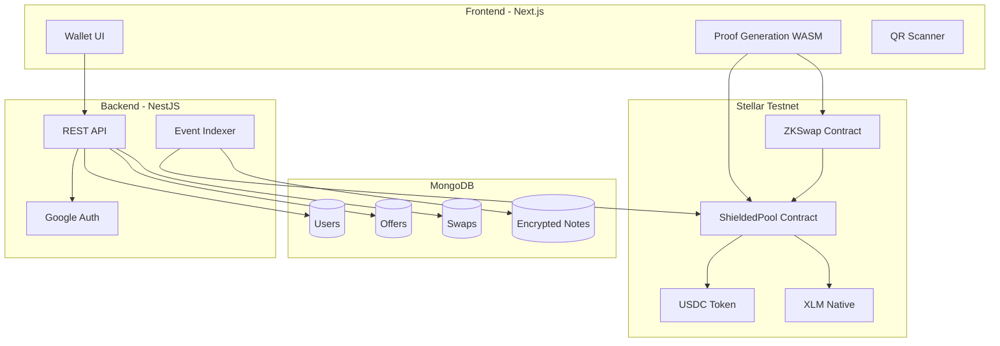

# Private P2P Payments and Swaps on Stellar Testnet - Implementation Plan

## Architecture Overview



---

## Key Technical Decisions

### 1. ZK Curve and Toolchain

- **Use BLS12-381** (not BN254) for circuits: The [soroban-privacy-pools](https://github.com/ymcrcat/soroban-privacy-pools) and [stellar soroban-examples groth16_verifier](https://github.com/stellar/soroban-examples/tree/main/groth16_verifier) use BLS12-381. X-Ray adds BN254, but the Groth16 verifier contract and Circom/SnarkJS ecosystem for Soroban are built around BLS12-381. BN254 support in Soroban is newer; stick with BLS12-381 for proven compatibility.
- **Poseidon host functions (X-Ray):** Use Poseidon host functions for Merkle tree operations inside contracts to support larger trees (soroban-privacy-pools was limited by in-contract Poseidon cost before CAP-75).
- **Circom + SnarkJS:** As specified. SnarkJS runs in browser via `snarkjs` npm package for client-side proof generation.

### 2. ShieldedPool Design: Note-Based vs Mixer

Your spec describes **private balances** (user owns notes; sends to another user; receiver decrypts). This differs from Privacy Pools (deposit/withdraw mixer).

**Adopted model:**

- **Commitment-merkle-nullifier** scheme (same crypto as Privacy Pools)
- **Transfer = consume notes + create output notes.** Sender proves: (1) owns consumed notes via Merkle inclusion, (2) sum consumed >= amount sent, (3) creates output note for recipient (encrypted) and change note for self
- **Encrypted notes:** Output note = `(commitment, ciphertext)` where `ciphertext` encrypts `(value, recipient_view_key_preimage)` for recipient decryption
- **Two pools:** One for USDC (token contract), one for XLM (native asset). Shared ZK circuits parameterized by asset.

### 3. Reference Codebases

| Component         | Source                                                                                                              | Use                                 |
| ----------------- | ------------------------------------------------------------------------------------------------------------------- | ----------------------------------- |
| Circuits (base)   | [soroban-privacy-pools/circuits](https://github.com/ymcrcat/soroban-privacy-pools)                                  | Merkle proof, commitment, nullifier |
| Groth16 verifier  | [stellar/soroban-examples/groth16_verifier](https://github.com/stellar/soroban-examples/tree/main/groth16_verifier) | On-chain verification               |
| circom2soroban    | soroban-privacy-pools `stellar-circom2soroban`                                                                      | VK/proof serialization              |
| coinutils pattern | soroban-privacy-pools `stellar-coinutils`                                                                           | Note generation, Merkle state       |

---

## Phase 1: Project Scaffold and Infrastructure

### 1.1 Monorepo Structure

```
lop/
├── packages/
│   ├── contracts/          # Soroban (Rust)
│   │   ├── shielded_pool/
│   │   └── zk_swap/
│   ├── circuits/           # Circom
│   │   ├── private_transfer/
│   │   └── atomic_swap/
│   ├── circuits-cli/       # circom2soroban, note-utils (Rust)
│   └── sdk/                # Shared TS types, client helpers
├── apps/
│   ├── web/                # Next.js frontend
│   └── api/                # NestJS backend
└── workers/
    └── indexer/            # Soroban event listener
```

### 1.2 Backend (NestJS)

- **MongoDB models:** `User`, `Offer`, `Swap`, `EncryptedNote` (for indexer-enqueued notes)
- **Auth:** `@nestjs/passport` + Google OAuth 2.0
- **Key generation:** Stellar keypair via `@stellar/stellar-sdk`; ZK keypair (spending key + view key) via custom crypto (e.g. `tweetnacl` for encryption, Poseidon for commitments)
- **Encryption:** Store `encryptedZkKey` (user secret encrypted with key derived from OAuth) in MongoDB
- **Endpoints:** `/auth/google`, `/auth/callback`, `/users/me`, `/users/:username`, `/offers`, `/offers/:id`, `/swap/request`, `/swap/accept`, `/faucet/xlm` (Friendbot), `/faucet/usdc` (Circle faucet integration)

### 1.3 Stellar Testnet Setup

- **RPC:** `https://soroban-testnet.stellar.org`
- **XLM faucet:** `https://friendbot.stellar.org/?addr=ADDRESS`
- **USDC faucet:** [Circle faucet](https://faucet.circle.com/) (Stellar testnet, ~20 USDC per 2h)
- **USDC contract:** Fetch from [Stellar Anchor directory](https://developers.stellar.org/docs/tokens/list) or Circle docs for testnet USDC address

---

## Phase 2: ZK Circuits and Toolchain

### 2.1 Private Transfer Circuit (`circuits/private_transfer/`)

**Logic:**

- Private inputs: `nullifiers[]`, `secrets[]`, `amount_sent`, `recipient_commitment`, `change_commitment`, `merkle_paths`, `merkle_root`
- Public inputs: `merkle_root`, `nullifier_hashes[]`, `output_commitments[]`
- Prove: (1) each nullifier/secret pair hashes to a commitment in the Merkle tree; (2) sum of consumed values >= amount_sent; (3) output_commitments = [change_note, recipient_note]; (4) nullifier_hash = H(nullifier) for each

**Files:**

- `transfer.circom` – main circuit
- `merkleProof.circom` – reuse from soroban-privacy-pools
- `poseidon255.circom` – reuse (BLS12-381 field)

**Build:**

- `circom transfer.circom --r1cs --wasm --sym -o build`
- SnarkJS: `snarkjs groth16 setup` with BLS12-381 (`--prime bls12381`)

### 2.2 Atomic Swap Circuit (`circuits/atomic_swap/`)

**Logic:**

- Alice proves: owns USDC notes totaling >= `amountUSDC`
- Bob proves: owns XLM notes totaling >= `amountXLM`
- Two separate proofs verified in one contract call (or two sequential calls with lock/release)

**Alternative:** Single “swap” circuit where both parties contribute private inputs; contract verifies both proofs and atomically updates both pools.

### 2.3 circom2soroban and Note Utils

- Fork/adapt `stellar-circom2soroban` from soroban-privacy-pools to convert VK/proof/public for `transfer` and `swap` circuits
- **Note utils (Rust or TS):** Generate coins (nullifier, secret, commitment), build Merkle state, create withdrawal/transfer inputs for circuits

---

## Phase 3: Soroban Contracts

### 3.1 ShieldedPool Contract

**Inspired by:** [soroban-privacy-pools contract](https://github.com/ymcrcat/soroban-privacy-pools/tree/main/contract)

**Functions:**

- `initialize(vk_bytes, token_address, admin)` – USDC pool; separate init for XLM pool (native asset)
- `deposit(from, commitment)` – deposit tokens/XLM, append commitment to Merkle tree
- `transfer(proof_bytes, pub_signals_bytes)` – verify ZK proof, check nullifiers unused, add output commitments, record nullifiers
- `get_merkle_root`, `get_nullifiers`, `get_commitments` – view functions

**Storage:**

- Merkle root (use Poseidon host for updates if available)
- Nullifier set
- Token/Native asset binding

**XLM pool:** Use Stellar native asset in Soroban; ensure contract supports both `Token` and `Native` asset types.

### 3.2 ZKSwap Contract

**Functions:**

- `request_swap(alice_proof, alice_pub, bob_proof, bob_pub, amount_usdc, amount_xlm)` – verify both proofs, lock both pools, atomically: consume Alice USDC notes + Bob XLM notes, create Alice XLM note + Bob USDC note
- Or: `lock_alice(proof, pub)` then `lock_bob(proof, pub)` then `settle()` for atomic completion

**Design:** Interact with two ShieldedPool instances (USDC and XLM) or a single multi-asset pool contract.

### 3.3 Groth16 Verifier

- Use pattern from [stellar/soroban-examples/groth16_verifier](https://github.com/stellar/soroban-examples/tree/main/groth16_verifier)
- Embed VK per circuit (transfer, swap) in contract constructor or use a shared verifier library

---

## Phase 4: Frontend (Next.js)

### 4.1 Auth and Onboarding

- Google Sign-In button
- On first sign-in: create Stellar keypair, ZK keypair; store encrypted in backend; display username, QR (Stellar address or app-specific handle)
- Faucet buttons: XLM (Friendbot), USDC (redirect or proxy to Circle faucet)

### 4.2 Wallet UI

- Private balance display (from indexer + decrypted notes)
- Send flow: pick recipient (username/QR), asset (USDC/XLM), amount; generate proof in browser (SnarkJS WASM); submit to ShieldedPool

### 4.3 Proof Generation (WASM)

- Bundle `snarkjs` and circuit artifacts (`main.wasm`, `main_final.zkey`) in Next.js
- Use `snarkjs.groth16.fullProve` in browser; serialize proof + public signals for Soroban
- Worker or defer to keep UI responsive (proofs can take seconds)

### 4.4 P2P Swap UI

- List offers from `/offers`
- Create offer (Bob: sell XLM for USDC, rate, min/max)
- Swap request (Alice) → backend creates Swap record → Bob accepts → both generate proofs → submit to ZKSwap

### 4.5 QR Code

- `qrcode.react` or similar for sharing address/receive
- `html5-qrcode` or `@zxing/library` for scanning

---

## Phase 5: Indexer and Notifications

### 5.1 Event Listener

- Node.js worker using `@stellar/stellar-sdk` + Soroban RPC `getEvents`
- Listen to `ShieldedPool` and `ZKSwap` contract events
- On `Deposit`/`Transfer`/`Swap`: persist event data (commitments, nullifiers, encrypted payloads) to MongoDB

### 5.2 Note Scanning

- Backend: for each user, scan new commitments from indexer
- Encrypted notes: only recipient can decrypt (view key)
- Polling or WebSocket to push “new private balance” to frontend

---

## Phase 6: Data Models and Encryption

### 6.1 User and Keys

```ts
User {
  _id, email, username,
  stellarPublicKey,
  stellarSecretKeyEncrypted,  // encrypted with KDF from session
  zkSpendingKeyEncrypted,
  zkViewKeyEncrypted,
  reputation
}
```

### 6.2 Encrypted Note Format

- Output note ciphertext: `encrypt((value, asset, memo?), recipient_view_key)`
- Use NaCl secretbox or similar; key derivation from shared secret (ephemeral key in note)

### 6.3 Offer and Swap

- As in [app.md](app.md): `Offer { merchantId, assetIn, assetOut, rate, min, max, active }`, `Swap { aliceId, bobId, status, amountIn, amountOut, txHash }`

---

## Dependencies

| Layer     | Key Packages                                                                      |
| --------- | --------------------------------------------------------------------------------- |
| Frontend  | Next.js 14, Tailwind, @stellar/stellar-sdk, snarkjs, qrcode.react, html5-qrcode   |
| Backend   | NestJS, @nestjs/passport, passport-google-oauth20, mongoose, @stellar/stellar-sdk |
| Contracts | rust, soroban-cli, rs-soroban-sdk (v25+)                                          |
| Circuits  | circom, snarkjs                                                                   |
| Workers   | @stellar/stellar-sdk, mongoose                                                    |

---

## Implementation Order

1. **Scaffold:** Monorepo, NestJS API, Next.js app, MongoDB models
2. **Auth:** Google OAuth, Stellar + ZK keypair creation, encrypted storage
3. **Circuits:** Private transfer circuit (extend soroban-privacy-pools), compile, trusted setup
4. **ShieldedPool contract:** Deploy USDC pool, then XLM pool; test deposit/transfer
5. **Faucets:** XLM Friendbot, USDC Circle integration
6. **Frontend wallet:** Balance, send flow, proof generation in browser
7. **Indexer:** Listen to ShieldedPool events, store notes
8. **Offers and ZKSwap:** Offer CRUD, swap request/accept, ZKSwap contract
9. **Atomic swap circuit + contract:** Implement and wire to P2P swap UI
10. **Polish:** QR, notifications, reputation placeholders

---

## Risks and Mitigations

| Risk                                | Mitigation                                                                   |
| ----------------------------------- | ---------------------------------------------------------------------------- |
| Proof generation slow in browser    | Use Web Worker; show progress; consider optional server-side proving for MVP |
| Curve mismatch (BLS12-381 vs BN254) | Stick to BLS12-381; verify SnarkJS and Soroban verifier use same curve       |
| Merkle tree depth                   | Use Poseidon host functions (X-Ray) to support larger trees                  |
| Native XLM in Soroban               | Confirm Stellar docs for native asset in contracts; may need wrapper         |
| USDC testnet address                | Document and test Circle faucet + contract address                           |

---

## References

- [Stellar X-Ray Protocol 25 Upgrade Guide](https://stellar.org/blog/developers/stellar-x-ray-protocol-25-upgrade-guide)
- [Prototyping Privacy Pools on Stellar](https://stellar.org/blog/ecosystem/prototyping-privacy-pools-on-stellar)
- [soroban-privacy-pools](https://github.com/ymcrcat/soroban-privacy-pools)
- [stellar/soroban-examples groth16_verifier](https://github.com/stellar/soroban-examples/tree/main/groth16_verifier)
- [Stellar Developer Docs - Soroban](https://developers.stellar.org/docs/build/smart-contracts)
- [Circle Testnet Faucet](https://faucet.circle.com/)
